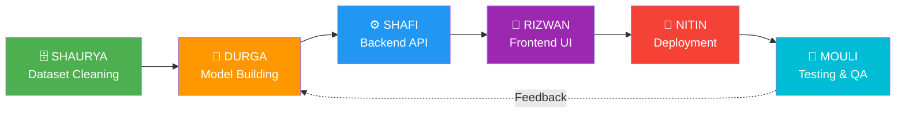
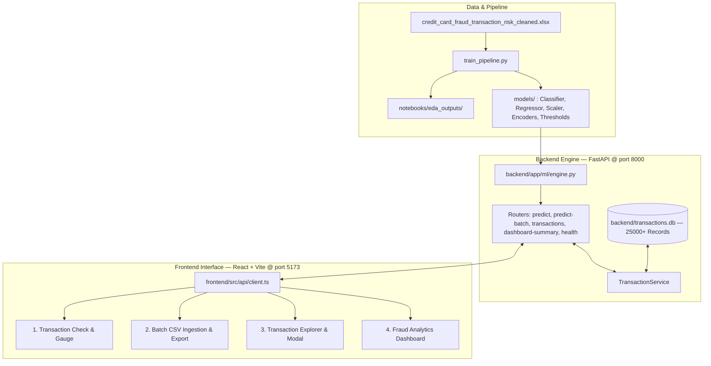

# FraudShield AI — Credit Card Fraud Detection and Transaction Risk Intelligence

[](https://credit-card-fraud-sheild-ai.streamlit.app/)
[](https://credit-card-fraud-sheild-ai.streamlit.app/)

> 🚀 **Live Web Application:** [https://credit-card-fraud-sheild-ai.streamlit.app/](https://credit-card-fraud-sheild-ai.streamlit.app/)  
> Experience the full FraudShield AI interactive detection platform in real time on Streamlit Community Cloud.

An enterprise-grade, end-to-end Credit Card Fraud Detection and Transaction Risk Analysis platform built with a dual Machine Learning architecture (Logistic Regression Fraud Classifier + LightGBM Continuous Risk Score Regressor + Behavioral Heuristic Engine), a robust FastAPI backend with SQLite persistence, and an interactive React + TypeScript + Tailwind CSS analytics dashboard.

---

## 👥 Team & Contributions

> **This is a collaborative group project built by a team of 6 engineers.**

<table>
  <tr>
    <th>👤 Member</th>
    <th>🎯 Role</th>
    <th>📦 Key Deliverables</th>
  </tr>
  <tr>
    <td><b>⭐ NITIN</b></td>
    <td>🏆 <b>Team Leader</b> · Model Deployment</td>
    <td>Project leadership, architecture design, end-to-end model deployment & production release</td>
  </tr>
  <tr>
    <td><b>SHAFI</b></td>
    <td>⚙️ Backend Development</td>
    <td>FastAPI server, API endpoints, SQLite persistence, transaction service & backend test suite</td>
  </tr>
  <tr>
    <td><b>SHAURYA</b></td>
    <td>🗄️ Database & Dataset Cleaning</td>
    <td>Raw data preprocessing, feature cleaning, data validation & Parquet optimization</td>
  </tr>
  <tr>
    <td><b>DURGA</b></td>
    <td>🤖 Model Building</td>
    <td>Fraud classifier, risk score regressor, feature engineering, model evaluation & selection</td>
  </tr>
  <tr>
    <td><b>RIZWAN</b></td>
    <td>🎨 Frontend Development</td>
    <td>React + TypeScript UI, interactive dashboards, risk gauge, batch upload & analytics views</td>
  </tr>
  <tr>
    <td><b>MOULI</b></td>
    <td>🧪 Testing & Quality Assurance</td>
    <td>Integration testing, verification gates, quality assurance & documentation support</td>
  </tr>
</table>

### 🔄 Team Workflow



---

## System Architecture



---

## 4 Strict Implementation Phases

### Phase 1: Model Building & Explainability
- **Dataset Analysis**: 25,000 transactions across 10 Indian cities. Baseline fraud rate = **8.15%** (2,038 Fraud, 22,962 Genuine), average transaction = ₹4,996.81, average risk score = 41.55.
- **EDA Visualizations** saved in `notebooks/eda_outputs/`:
  - `eda_1_class_imbalance.png`: Class distribution and imbalance analysis.
  - `eda_2_amount_vs_fraud.png`: Ticket size distributions.
  - `eda_3_hour_vs_fraud.png`: Hourly fraud concentration curve.
  - `eda_4_distance_vs_fraud.png`: Geo-spatial displacement densities.
  - `eda_5_location_mismatch_vs_fraud.png`: Home vs Transaction city divergence.
  - `eda_6_failed_attempts_vs_fraud.png`: Authentication failure correlations.
  - `eda_7_correlation_heatmap.png`: Numeric correlations against Fraud Risk Score.
  - `eda_8_risk_score_distribution.png`: Risk score distributions with the 60.0 threshold.
  - `eda_9_feature_importances.png`: Top 12 model feature weights.
- **Feature Engineering**:
  - `day_of_week`, `is_night_transaction` (00:00 - 05:59).
  - `amount_vs_avg_ratio` = $\frac{\text{Transaction\_Amount}}{\text{Customer\_Avg\_Transaction\_Amount}}$.
  - `velocity_score` = $\text{Transactions\_Last\_24h} + \text{Failed\_Attempts\_Last\_24h}$.
  - Ordinal encoding for `Customer_Risk_Profile` (Low: 0, Medium: 1, High: 2).
  - One-Hot encoding for `Merchant_Category`, `Device_Type`, `Payment_Method`, `Customer_Home_Location`, `Transaction_Location`.
- **Classification Engine (`model_fraud_classifier.pkl`)**:
  - Evaluated: Logistic Regression (balanced), Random Forest, XGBoost, LightGBM.
  - Primary metric: Recall & PR-AUC. Best: Logistic Regression (Recall: 64.71%, PR-AUC: 0.2029, ROC-AUC: 0.7148).
- **Risk Scoring Engine (`model_risk_score.pkl`)**:
  - Evaluated: Random Forest, Gradient Boosting, XGBoost, LightGBM.
  - Primary metric: $R^2$ & MAE. Best: LightGBM Regressor ($R^2$: 0.8008, MAE: 5.13, RMSE: 6.90).
- **Suspicious Transaction Rule**:
  - `is_suspicious` = `(Fraud_Risk_Score >= 60.0) or (fraud_probability >= 0.50) or (Location_Mismatch=Yes and Distance > 150km and Failed_Attempts >= 2)`.

---

### Phase 2: FastAPI Backend Engine
- **Modular Directory Architecture**:
  - `backend/app/main.py`: FastAPI server with CORS, request logging, and lifespan loading.
  - `backend/app/ml/engine.py`: Thread-safe inference engine with dynamic explainability reasons.
  - `backend/app/models/schemas.py`: Strict Pydantic v2 schemas and enums.
  - `backend/app/services/transaction_service.py`: SQLite persistence and live analytics aggregations.
  - `backend/app/routers/`: `/predict`, `/predict/batch`, `/transactions`, `/dashboard/summary`, `/health`.
- **Persistence & Seeding**:
  - Seeded 25,000 transactions from the dataset into `backend/transactions.db`.
  - All new transactions scored via API are stored in the database.
- **Automated Test Suite**:
  - 7 integration tests passing in `backend/tests/test_api.py` (Health, Single Predict, Validation 422 errors, Batch Predict, Live Dashboard Summary, Pagination, and Detail View).

---

### Phase 3: Frontend Experience
- **Stack**: React 18, TypeScript, Vite, Tailwind CSS, Recharts, Lucide Icons.
- **Key Views**:
  1. **Transaction Check**: Form with 5 required inputs, advanced attributes accordion, 3 instant test presets, animated circular SVG risk score gauge, and AI explainability drivers.
  2. **Batch Upload**: Drag-and-drop CSV ingestion, sample CSV template download, real-time bulk scoring, search/filter table, and scored CSV export.
  3. **Transaction Explorer**: Searchable and filterable table querying the live 25,000+ database records with pagination, multi-criteria filters, and detailed drill-down modal.

---

### Phase 4: Fraud Analytics Dashboard
- **Live KPI Cards**:
  - Total Transactions: **25,000+**
  - Fraud Count & Rate: **2,038 (8.15%)**
  - Average Transaction Amount: **₹4,996.81**
  - Average Fraud Risk Score: **41.55 / 100**
  - Suspicious Transactions: **3,559 (14.24%)**
- **Interactive Visualizations**:
  - Fraud rate by Merchant Category (bar chart)
  - Fraud rate by Location Mismatch (geo-spatial comparison)
  - Risk score distribution histogram (0-100 bins)
  - Hourly fraud rate trend (00:00 to 23:00 line curve)
  - Fraud by Device Type (grouped bar)
  - Customer Risk Profile vs actual fraud outcomes (stacked bar)
  - Live Alerts Panel with drill-down modals
  - Global filter bar & CSV/PDF report export.

---

## Setup & Execution Guide

### 1. Prerequisites
- Python 3.11+
- Node.js 18+ and npm

### 2. Environment Setup
```powershell
# Create and activate virtual environment
uv venv .venv --python 3.11
.\.venv\Scripts\activate

# Install Python dependencies
uv pip install -r backend/requirements.txt
```

### 3. Model Training & Pipeline Run
```powershell
# Train classification & regression models and generate EDA charts
.\.venv\Scripts\python.exe train_pipeline.py

# Verify Phase 1 test gate
.\.venv\Scripts\python.exe test_phase1_gate.py
```

### 4. Database Seeding & Verification
```powershell
# Seed 25,000 dataset transactions into SQLite database
.\.venv\Scripts\python.exe backend/scripts/seed_from_dataset.py

# Run backend pytest test suite
.\.venv\Scripts\pytest.exe backend/tests/ -v
```

### 5. Launch Backend Server
```powershell
.\.venv\Scripts\uvicorn.exe backend.app.main:app --host 127.0.0.1 --port 8000 --reload
```
API Documentation available at: [http://127.0.0.1:8000/docs](http://127.0.0.1:8000/docs)

### 6. Launch Frontend Server
```powershell
cd frontend
$env:PATH = "C:\Program Files\nodejs;" + $env:PATH
npm install
npm run dev -- --host 127.0.0.1 --port 5173
```
Access the application at: [http://127.0.0.1:5173](http://127.0.0.1:5173)

### 7. Launch Streamlit Cloud & Local App
- **Live Deployed App**: [https://credit-card-fraud-sheild-ai.streamlit.app/](https://credit-card-fraud-sheild-ai.streamlit.app/)
- **Run Locally via Streamlit**:
```powershell
streamlit run streamlit_app.py
```

---

## Repository Artifact Directory Structure
```
├── streamlit_app.py                                  # Streamlit Cloud deployment entry point
├── DEPLOY.md                                         # Streamlit Cloud deployment guide
├── credit_card_fraud_transaction_risk_cleaned.xlsx   # Source dataset
├── transactions.parquet                               # Optimized dataset
├── train_pipeline.py                                 # Phase 1 training pipeline
├── test_phase1_gate.py                               # Phase 1 verification gate
├── test_live_server.py                               # Phase 2 live HTTP test script
├── pytest.ini                                        # Pytest configuration
├── README.md                                         # Project documentation
├── models/
│   ├── model_fraud_classifier.pkl                    # Best classifier
│   ├── model_risk_score.pkl                          # Best regressor
│   ├── scaler.pkl                                    # Fitted StandardScaler
│   ├── encoders.pkl                                  # Categorical metadata
│   ├── feature_columns.json                          # Feature list (55 cols)
│   ├── feature_importances.json                      # Top feature weights
│   ├── metrics_summary.json                          # Model metrics
│   └── threshold_config.json                         # Suspicious policy thresholds
├── notebooks/
│   ├── model_training.ipynb                          # Jupyter notebook report
│   ├── model_card.md                                 # Model card documentation
│   └── eda_outputs/                                  # 9 High-res EDA charts
├── backend/
│   ├── transactions.db                               # SQLite database (25,000+ rows)
│   ├── requirements.txt                              # Python requirements
│   ├── .env                                          # Backend configuration
│   ├── app/
│   │   ├── main.py                                   # FastAPI entry point
│   │   ├── config.py                                 # Environment config
│   │   ├── database.py                               # DB initialization & connections
│   │   ├── ml/engine.py                              # Real-time ML inference
│   │   ├── models/schemas.py                         # Pydantic schemas
│   │   ├── services/transaction_service.py           # DB queries & aggregations
│   │   └── routers/                                  # API endpoints
│   ├── scripts/seed_from_dataset.py                  # DB seeding script
│   └── tests/test_api.py                             # Pytest integration tests
└── frontend/
    ├── package.json                                  # NPM dependencies
    ├── vite.config.ts                                # Vite configuration
    ├── tailwind.config.js                            # Tailwind styling configuration
    ├── index.html                                    # Web template
    └── src/
        ├── App.tsx                                   # Main view router
        ├── index.css                                 # Glassmorphic custom CSS
        ├── api/client.ts                             # Typed API client
        ├── types/index.ts                            # TypeScript schemas
        ├── components/
        │   ├── Navbar.tsx                            # Top navbar with live status
        │   ├── RiskGauge.tsx                         # Circular SVG risk meter
        │   └── TransactionDetailModal.tsx            # Explainability drilldown modal
        └── pages/
            ├── TransactionCheckPage.tsx              # Single transaction scoring
            ├── BatchUploadPage.tsx                   # Bulk CSV scoring & export
            ├── TransactionExplorerPage.tsx           # Database table & filters
            └── DashboardPage.tsx                     # Live analytics & KPI metrics
```
